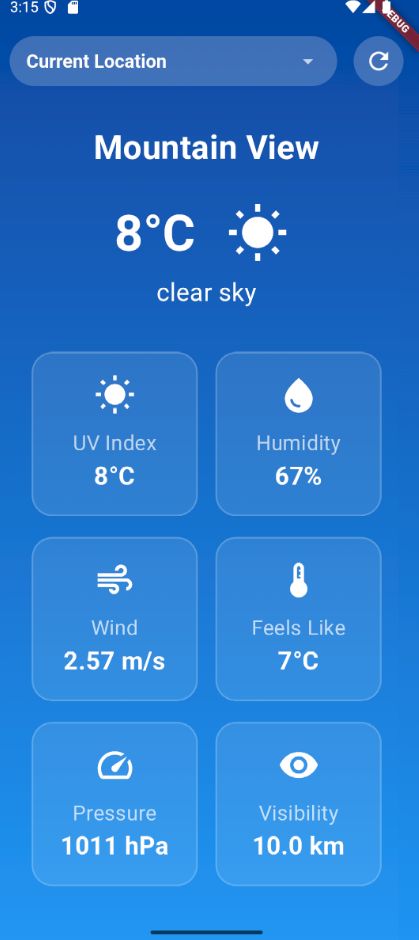
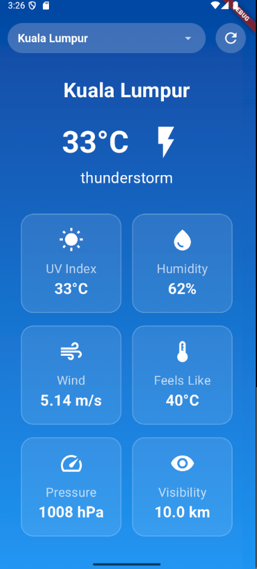
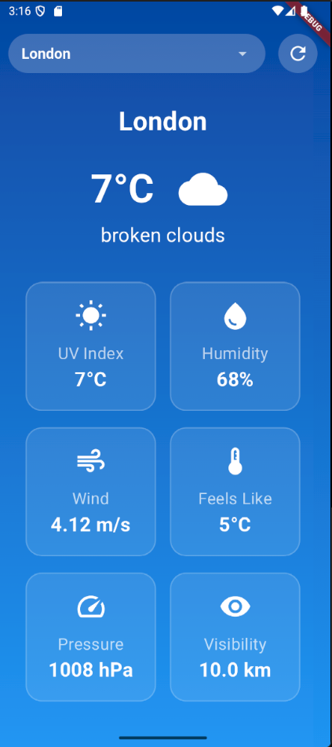

# 🌦 Weather App

A simple **Weather App** that fetches real-time weather data using the **OpenWeatherMap API**.  
 

## 📌 Features
🌍 Get current weather
📍 Displays **temperature, humidity, wind speed, UV index, pressure, and visibility** 
🔄 Refresh weather updates in real-time
🎨 Clean and responsive UI
✅ Works on both mobile & desktop. 

## 📸 Screenshots





## 🔧 Technologies Used
- **Programming Language**: Flutter (Dart)
- **API**: OpenWeatherMap API  
- **Frontend**: Flutter UI    

## 🚀 How to Run the App  
1. **Clone the repository**  
   ```sh
   git clone https://github.com/your-username/weather-app.git
   cd weather-app

2. **Install dependencies**
    ```sh
    flutter pub get

3. **Get OpenWeatherMap API Key**

    Sign up at OpenWeatherMap
    Generate an API Key
    Add it to your .env file (or directly inside the code)

4. **Run the app**
    ```sh
    flutter run

